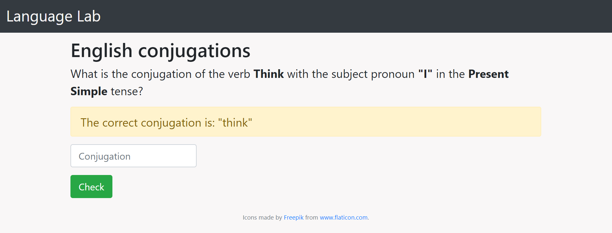

# Language Lab

## Website description
Language Lab is a website where you can practice the conjugations of the 25 most common verbs in a target language. This allows for practical and efficient language learning, giving you a solid foundation to comprehend and converse.

### Homepage/Tenses
Here is how the homepage looks. This is where one can select the target language they would like to practice
from the dropdown menu. For now, I have only populated English, but more languages can be added in the future. With your chosen language you can select which tenses you would like to practice for the 25 most common verbs.

| Homepage view             | Tenses view |
:-------------------------:|:-------------------------:
  |  

### Conjugation (Correct/Incorrect)
Afterwards, you can jump right into practice. The web application will prompt you with a subject pronoun,
verb, and tense to conjugate. If you get the conjugation correct, the view will flash "Correct" and move on to the next conjugation. If you get the conjugation incorrect, you will be given the correct response and be given the chance to retry the conjugation.

| Conjugation views |
:-------------------------:

  
